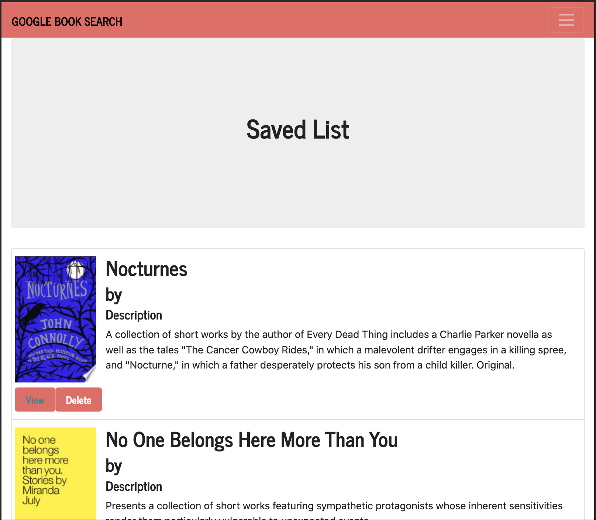

# google Book Search

  
  

[Explore the docs](https://github.com/puakehaulani/google-book-search)  
[See the deployment](https://warm-atoll-10602.herokuapp.com/)

---

## Table of Contents

- [About the Project](#About-the-Project)
- [Usage](#Usage)
- [Getting Started](#Getting-Started)
  - [Installation](#Installation)
- [Testing](#Testing)
- [Contributing](#Contributing)
- [License](#License)
- [Questions](#Questions)

## About the Project

google Book Search calls the google Books API to search for books by title, and save books to a database, to be referenced any time in the future. It is made with React.

## Usage

Run the following commands in your terminal

    npm start

Navigate in the browser to

    localhost:3000

## Getting Started

To get started, follow these steps:

### Installation

Run the following commands in your terminal

    npm i

## Testing

Run the following command in your terminal

    npm test

## Contributing

Contributions are welcome! Please create an issue or pull request with your input.

## License

This application is covered under the MIT license

## Questions

For any questions, please reach out to <puakehaulani@gmail.com>  
[Developer repo](http://github.com/puakehaulani)
